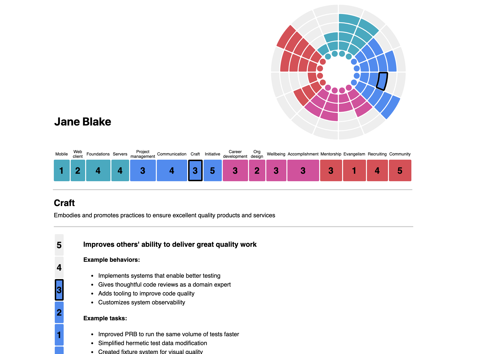

# Snowflake-lite

This tool and any associated data is for generating ideas in support of an individuals professional growth only. It is NOT an official Hootsuite tool or part of Hootsuites compensation or promotion process. It CANNOT be used as performance or promotion criteria.

This is a modified version of Snowflake which was a tool developed by Medium for planning and supporting engineers' career development with a strong focus an individuals growth. You can read more
about how the original tool was used in Medium's [growth framework documentation](https://medium.com/s/engineering-growth-framework).

## Installation

Get [node and npm](https://nodejs.org/en/download/package-manager/) if you don’t have them already.

Install dependencies:

`npm install`

### Running the dev server

`npm run dev`

You should then be able to connect useing a browser to *localhost:3000*

### Building

`npm run export`

This will put a static version of the site in `out/`. 
This does not seem to work as the paths get messed up. 
Since what is being run is `next build` followed by `next export` a solution may or may not be found [here](https://nextjs.org/docs#static-html-export).  

